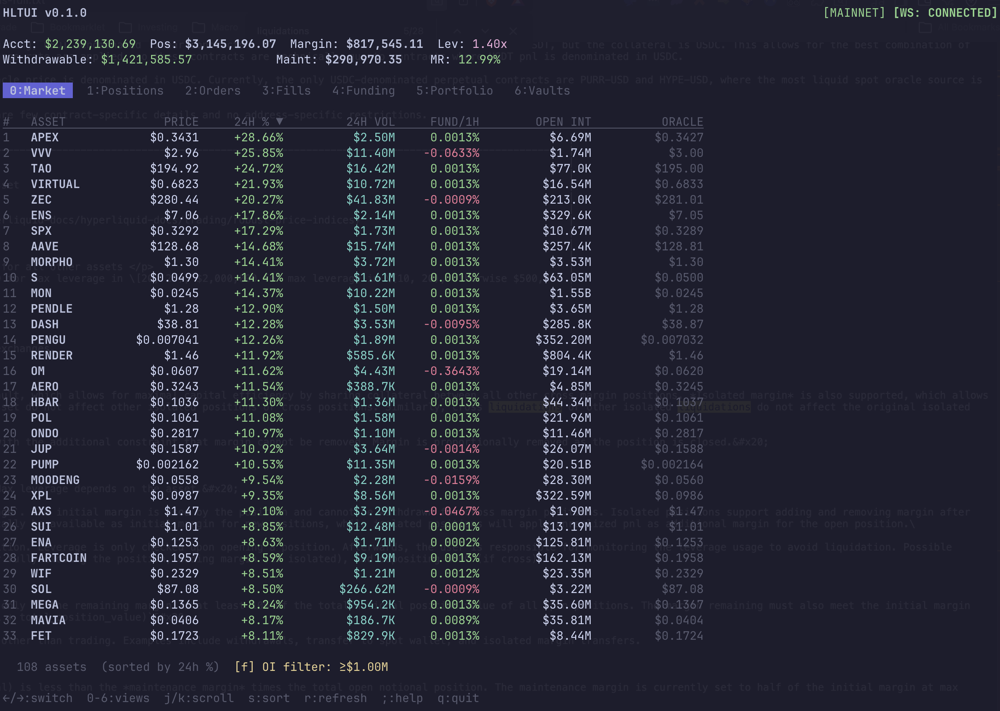

# hltui

Real-time terminal dashboard for [Hyperliquid](https://hyperliquid.xyz). Monitor positions, orders, fills, funding, portfolio, and vaults from your terminal.




## Features

- **Market** — All assets sorted by 24h % change with price, volume, funding, and open interest
- **Positions** — Open positions with PnL, ROE, leverage, funding fees, and liquidation prices
- **Orders** — Open and pending orders
- **Fills** — Recent trade history with realized PnL and fees
- **Funding** — Funding payment history
- **Portfolio** — Account performance and fee tracking
- **Vaults** — Vault investments with PnL and APR

Live data via WebSocket. Read-only — no private keys needed.

## Install

```sh
curl -sSfL https://raw.githubusercontent.com/born1337/hyperliquid-terminal/main/install.sh | sh
```

### From source (requires Go 1.25+)

```sh
go install github.com/born1337/hyperliquid-terminal@latest
```

## Usage

```sh
hltui <ethereum-address>
```

### Flags

| Flag | Description |
|------|-------------|
| `-t`, `--testnet` | Use Hyperliquid testnet |
| `-V`, `--vault` | Treat address as a vault |

### Examples

```sh
# Monitor an address
hltui 0xYourAddressHere

# Use testnet
hltui -t 0xYourAddressHere

# Monitor a vault
hltui -V 0xVaultAddressHere
```

## Keyboard Shortcuts

| Key | Action |
|-----|--------|
| `Tab` / `Shift+Tab` | Cycle views |
| `←`/`→` or `h`/`l` | Switch views |
| `0`-`6` | Jump to view |
| `j`/`k` or `↑`/`↓` | Scroll |
| `s` | Toggle sort direction |
| `f` | Cycle OI filter (Market) |
| `w` | Wallet picker (switch/add/delete) |
| `r` | Refresh data |
| `;` | Help |
| `q` | Quit |

## License

MIT
